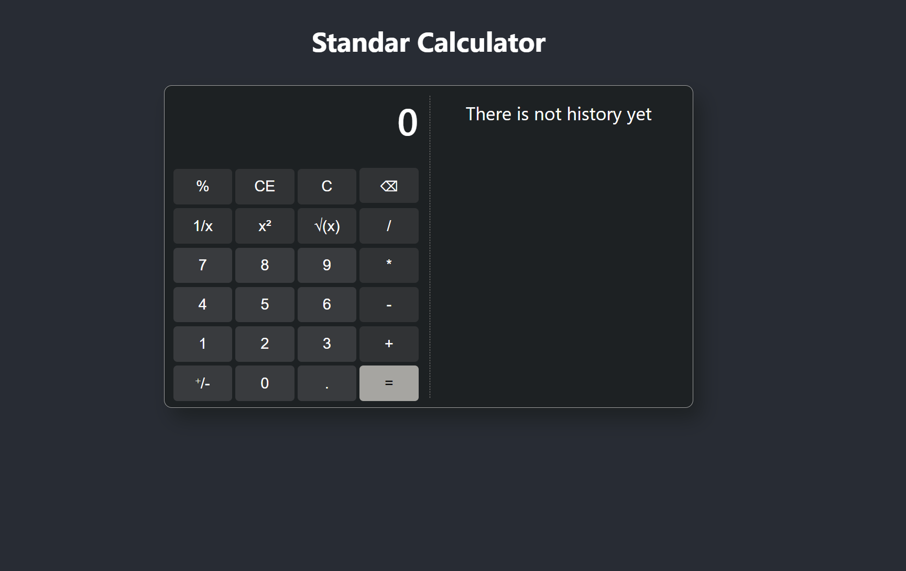
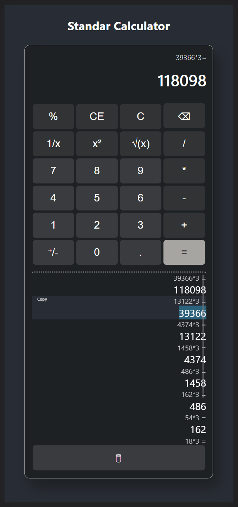

# Standar Calculator
This is a simple calculator developed in JavaScript using ReactJs to test the ReactJs hooks between components.

The calculator must work same that the Microsoft Standar Calculator, which the style was taken from.

A thing to have in mind, i used the eval function from JavaScript to resolve the ecuaciones, eval is not recommended but is easy to implement, take care of that if you need, you can call a function instead.

 

 

This project was bootstrapped with [Create React App](https://github.com/facebook/create-react-app).

## Available Scripts

In the project directory, you can run:

### `npm start`

Runs the app in the development mode.\
Open [http://localhost:3000](http://localhost:3000) to view it in your browser.

The page will reload when you make changes.\
You may also see any lint errors in the console.